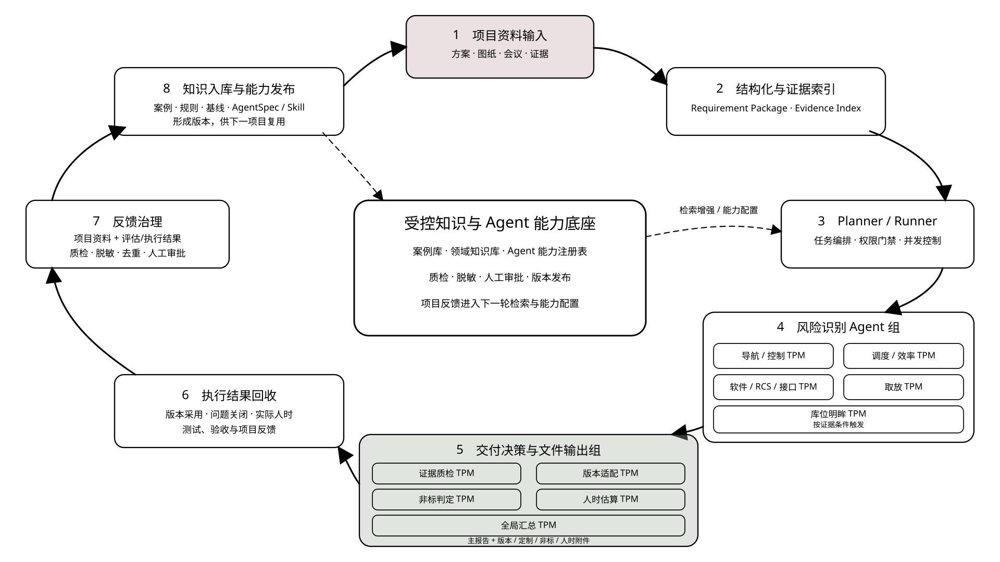
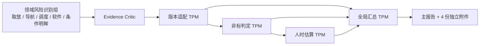

# 多 Agent 非标功能开发风险识别架构

## 1. 架构总览



项目内决策链保持短而清晰：



评审目标只有一个：判断项目功能需求是否超出标准产品或推荐版本能力，从而形成非标准功能开发风险。硬件选型、EHS、安全认证、土建、施工和一般现场整改均不进入本评审链。

项目完成后，版本采用、风险关闭、实际人时、测试与验收结果进入受控反馈区，经质检、脱敏、去重和人工审批后，按版本更新项目案例库、领域知识库和 Agent 能力注册表，再为下一项目提供检索知识、Prompt/Skill、工具范围和评审基线。原始资料和单次评估结果不得直接写入长期知识。

## 2. 分层与所有权

| 层 | 责任 | 不负责 |
|---|---|---|
| Gateway | 建立 ProjectKey、request_id、trace_id、显式附件清单、解析状态和写权限 | 领域判断 |
| Planner | 选择 Agent、切分任务、输出结构化 TaskPlan | 写最终结论 |
| Runner | 阶段顺序、依赖、并发上限、失败隔离、写入串行 | 修改专业结论 |
| 取放 TPM | 核对载具/货物尺寸与容差、叉孔/梁体几何、停靠与取放容差、堆叠和对接能力边界 | 硬件选型、EHS、土建和一般现场整改 |
| 其他领域 Worker | 在导航、调度、软件或条件明眸单一领域识别功能开发风险 | 版本选择、工时估算、写最终文档 |
| Evidence Critic | 检查无依据结论、重复、冲突、附件解析缺口和越界 | 静默删除风险 |
| 版本适配 TPM | 汇总单车、RCS/中控、明眸等模块能力证据，选择一个项目级完整版本包并确定版本风险等级 | 判定非标、创建开发范围、估算人时或按模块拆分版本 |
| 非标判定 TPM | 对已有功能交付项逐项分类，识别真正超出标准版本边界的非标开发 | 新增需求、选择版本、估算人时或承诺交付 |
| 人时估算 TPM | 对已分类且有稳定 ID 的功能工作项，按阶段、角色和依据给出低/最可能/高人时 | 硬件、现场工作；新增或重分类范围 |
| Global Summary TPM | 保留冲突、统一口径，串行生成主报告和四份独立附件 | 修改原始资料或重新发明专业结论 |
| 反馈治理 | 回收实际结果，执行质检、脱敏、去重、人工审批和知识候选归类 | 自动把单项目结论写入长期知识 |
| 知识与能力底座 | 版本化管理案例库、领域知识库、AgentSpec/Skill、工具范围与评审基线 | 替代当前项目证据或绕过权限门禁 |

## 3. 并发与依赖

- 取放、导航、调度、软件四个核心领域可并发；明眸按触发证据条件启动。
- 领域 Agent 并发上限为 2。每个请求独立使用 120 秒超时和最多 1 次重试；单个 Agent 失败转为带覆盖缺口的失败结果，不取消其他 Agent。
- 跨 Agent 提问只有一轮；每个 Agent 整个评审最多提出 1 个问题，只能选择最可能需要新增或修改产品功能的问题。回答不得再触发追问。
- 领域 Worker 完成后运行 Evidence Critic。
- `version_fit_tpm` 等待 Critic。
- `nonstandard_classifier_tpm` 等待版本建议，只对已有功能交付项分类；不设置“定制范围 TPM”。
- `effort_estimation_tpm` 等待版本和非标结果，只估算已有稳定来源 ID 的功能工作项。
- `global_summary_tpm` 是唯一最终文件写入者，所有最终写入串行执行。
- 单个 Agent 或单个附件解析失败不终止整个评审；失败、覆盖缺口和不确定性必须写入 manifest 与最终文档。

## 4. 决策输入门槛

- 取放输入：载具/货物类型、名义尺寸、上下偏差或范围、重量/重心、叉孔/纵梁/横梁几何、材质和状态、停靠偏差、取放高度与相邻间距。
- 版本建议输入：产品版本能力矩阵、当前发布基线、已知限制、兼容策略。
- 非标判定输入：版本建议、标准能力边界、已质检风险和项目需求证据。
- 人时建议输入：已分类功能工作项、依赖、复杂度、历史工时基线或经授权专家估算规则。

缺少载具容差时，取放结论必须保留高/中/低暂定等级、降低置信度并进入现场适配待确认清单，不能用名义尺寸代替；缺少版本能力矩阵时，版本与非标结论写“待负责人确认”；缺少工时基线时，对应工作项写“不可可靠估算”。

## 5. 上下文与附件

Gateway 必须显式记录每个上传附件的文件名、类型、大小、哈希、解析状态和提取内容边界。当前项目附件优先于长期知识；Office、PDF 和文本附件应按类型解析。某一附件失败时保留其他附件，并明确写“已收到但解析失败”，不得写成“未收到原始资料”。

默认只做轻量需求建模：保留附件解析摘要，提取关键字段，只归一当前资料实际出现的同义词，生成短 `REQ-*`—证据索引，并单列冲突和缺失。不得重写整份项目资料或生成长篇业务叙述。

领域 Worker 只可见自己的 AgentSpec、AgentTask、相关资料章节和证据切片。决策 Agent 只可见已质检领域结果、直接依赖结果和必要产品基线。Global Summary TPM 可见全部结构化结果、冲突清单和输出要求。

## 6. 存储结构

```text
<ProjectOutputDir>/
  review_analysis.md
  review_analysis.html
  version_recommendation.md
  version_recommendation.html
  custom_development_checklist.md
  custom_development_checklist.html
  nonstandard_development_items.md
  nonstandard_development_items.html
  effort_recommendation.md
  effort_recommendation.html
  agent_trace/
    <trace_id>/
      plan.json
      parsed_sources.md
      agent_results/
        pick_place_tpm.json
        navigation_control_tpm.json
        dispatch_efficiency_tpm.json
        software_rcs_interface_tpm.json
        mingmou_risk_tpm.json
      critic_result.json
      decision_results/
        version_fit_tpm.json
        nonstandard_classifier_tpm.json
        effort_estimation_tpm.json
      final_risk_register.json
      final_manifest.json
```

## 7. 明眸触发规则

四个核心领域默认参与完整项目评审。明眸 Agent 仅在资料或用户请求出现库位明眸、库位视觉/状态监测、相机推理、RTSP/PoE、人车货托盘视觉识别，或明眸到 RCS/WMS/单车的状态与告警接口时参与。只有未来可能增加视觉的讨论时，仅作为范围变更提醒。

## 8. 安全、权限与回退

- ToolExecutor 根据 `agent-roster.yaml` 执行权限门禁。
- Planner、领域 Agent、Critic 和三个决策 Agent 均只读。
- 最终写入限定在当前 ProjectOutputDir；导出覆盖需确认。
- 原始资料、结构化资料包、evidence_index 和各 Agent 原始结果只读。
- 知识发布必须记录来源项目、证据、审批人、版本号、生效范围和回滚版本。
- Planner JSON 失败时使用默认阶段与依赖图，并在 manifest 标记回退。
- 不支持子 Agent 时，Runner 按相同 AgentSpec 顺序执行并保留独立结果，manifest 标记 `single_agent_fallback`。
- 全局汇总失败时保留已有只读结果，不覆盖上一版有效最终文件。
