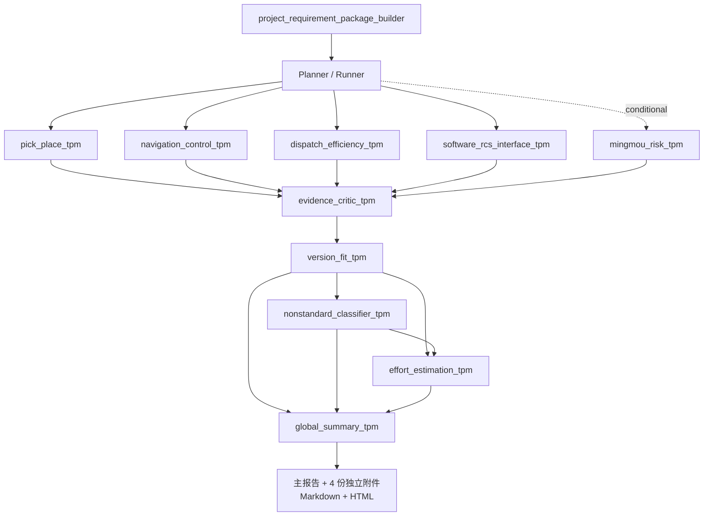

# 方案评审 Skill

## Scope

Use this Skill to run a complete project review workflow on Windows:

1. Ingest a project资料包 into a stable input directory.
2. Generate a structured, evidence-backed `project_requirement_package`.
3. Read the package and produce a review analysis for TPM/研发/方案 follow-up.
4. Store all final review deliverables under the original project folder's `评估结果/` directory.
5. Register the project result into the shared `项目汇总包`.

This Skill orchestrates the existing `project_requirement_package_builder` Skill. It may summarize risks and recommendations, but do not invent final commitments. Mark unresolved items as pending and point to evidence.

For complete or cross-domain reviews, orchestrate `multi-agent-risk-review` after the structured package passes validation. Use `mingmou-risk-tpm` only when the project data or user request contains 库位明眸/环境监控/库位视觉/安全区域视觉 signals. The main report and all four attachments, in both Markdown and HTML, must be written by `global-summary-tpm`, not independently by domain or decision Agents. Hardware selection, EHS, civil work and general site adaptation are outside this review.

### Current Agent Architecture

The review path is:



Domain, critic and delivery-decision Agents are read-only. Only `global_summary_tpm` may write the final files, after all dependency checks complete.

## Workspace Paths

Assume the migration root contains the sibling folders `01_Agent程序与知识库` and `02_项目资料与运行数据`.

Use these fixed locations:

| Purpose | Path |
|---|---|
| New project raw inputs | `02_项目资料与运行数据/Agent运行数据/projects_input/<ProjectKey>/` |
| Working/staging project package | `02_项目资料与运行数据/Agent运行数据/output/<ProjectKey>/` |
| Final per-project deliverables | `<OriginalProjectDir>/评估结果/` |
| Existing package builder Skill | `01_Agent程序与知识库/Agent工作区/skills/project_requirement_package_builder/` |
| Shared review summary package | `02_项目资料与运行数据/Agent运行数据/项目汇总包/` |
| Per-project review records | `02_项目资料与运行数据/Agent运行数据/项目汇总包/records/<ProjectKey>.md` |
| Windows helper scripts | `01_Agent程序与知识库/Agent工作区/scripts/` |

Read `references/output-storage-map.md` when the task asks where outputs or new analysis should be saved.

## Project Key

Choose a stable `<ProjectKey>` before running anything:

- Prefer `<project_no>_<short_customer_or_site>`, for example `26068_068_napoleon_tugger_phase2`.
- Use only letters, digits, `_`, and `-`.
- Reuse the same key for input folder, output folder, summary CSV row, and record file.

## Standard Workflow

### 1. Place Inputs

Put all raw files for a new project under:

```text
02_项目资料与运行数据/Agent运行数据/projects_input/<ProjectKey>/
```

Keep the user's original filenames and subfolders. Do not flatten or rename source files unless the user asks.

### 2. Run Extraction And Scaffold

From the workspace root, run:

```powershell
powershell -NoProfile -ExecutionPolicy Bypass -File ".\01_Agent程序与知识库\Agent工作区\scripts\Run-ExtractProject.ps1" `
  -InputDir ".\02_项目资料与运行数据\Agent运行数据\projects_input\<ProjectKey>" `
  -ProjectKey "<ProjectKey>" `
  -ProjectName "<ProjectName>"
```

This creates:

```text
02_项目资料与运行数据/Agent运行数据/output/<ProjectKey>/
  extracted/
  assets/
  project_requirement_package.draft.md
  missing_info_checklist.draft.md
```

### 3. Complete The Structured Package

Use `project_requirement_package_builder/SKILL.md` to finish the final files in:

```text
02_项目资料与运行数据/Agent运行数据/output/<ProjectKey>/
```

Required final files:

```text
project_requirement_package.md
project_requirement_package.html
metadata.json
evidence_index.json
missing_info_checklist.md
```

Important rules:

- Keep evidence IDs traceable.
- List conflicting values side by side.
- Separate original evidence from AI inference.
- Label the basis type for every important requirement, risk, conclusion, and recommendation. Use only these labels: `原文明确`, `会议口头信息`, `AI归类`, `AI推断待确认`, `条件性推断`, `无原文依据-不列为当前风险`.
- Never write a conditional inference as a current project requirement or confirmed risk. If a statement means "if the customer later asks for X", mark it as `条件性推断` and put it in a scope-change note, not in the current risk table.
- If a conclusion has no source in the project files, state `无原文依据-不列为当前风险` and do not use it to raise the current risk level.
- Version and effort outputs are evidence-backed recommendations, not final commitments. Missing baselines must be shown as pending confirmation or not estimable; final approval remains with the version, engineering and TPM owners.

### 3.1 Risk Classification Boundaries

Keep review risks separated by review perspective. RCS functions belong to software. Dispatch review is not a software module review; it focuses on congestion, takt, throughput, efficiency, resource bottlenecks, and whether the overall operation can meet demand.

| Category | Include | Do Not Include |
|---|---|---|
| Navigation / positioning / control | localization stability, path passability, clearance, stopping accuracy, docking/approach control, site dynamic obstacles | task logic, RCS configuration, interface signal definitions, throughput math |
| Dispatch / efficiency | congestion, route conflict, queueing pressure, takt/cycle time, PPH, peak throughput, vehicle count, charger/charging bottleneck, shared-resource capacity, manual-release impact on efficiency | RCS feature ownership, task configuration details, PLC protocol details, HMI wording, pure vehicle control accuracy |
| Software / RCS / interface / HMI | RCS functions, task configuration, workflow configuration, location state logic, deep-lane rules, task exception handling, PLC/S7/WMS/WCS/MES interfaces, signal tables, state display, HMI prompts, reset entry, deployment/network configuration, debugging feasibility | throughput sufficiency as a business/operation result; pure navigation clearance |
| Hardware / safety / site | sensors, forks, charger, server, guards, site modification, safety device coverage, EHS constraints | RCS task configuration, interface signal definitions, throughput math |

节拍/效率需求和调度风险强相关。Whenever a project has throughput, PPH, cycle time, shift, peak, takt, route length, vehicle count, or charger/charging assumptions, explicitly evaluate dispatch/efficiency impact. If the project says “no throughput required”, still record that assumption and verify whether congestion, queueing, charging, multiple workflows, shared locations, manual release, or vehicle count can create hidden efficiency risk.

Dispatch/efficiency review must answer:

- What is the takt/throughput/PPH/peak demand, and is it explicit or assumed?
- Are vehicle count, route length, cycle time, and charging strategy enough for the demand?
- Where can queues, congestion, route conflicts, or shared-resource bottlenecks appear?
- Do multiple workflows compete for the same vehicle, path, charger, pickup/drop point, or staging lane?
- Does manual release/clearance create waiting time, starvation, or hidden throughput loss?
- If there is no takt requirement, is that a contractual assumption or only a meeting statement?

Software/RCS review must answer:

- Can existing RCS functions and task configuration express the required workflow?
- Can location state, deep-lane logic, priority, exception recovery, and task reset be configured or debugged without new development?
- Are PLC/S7/WMS/WCS/MES signal tables, trigger semantics, HMI states, and debugging tools sufficient?
- What must be confirmed by software/RCS engineers before promising standard capability?

### 4. Render And Validate

Run:

```powershell
powershell -NoProfile -ExecutionPolicy Bypass -File ".\01_Agent程序与知识库\Agent工作区\scripts\Render-ValidateProject.ps1" `
  -ProjectOutputDir ".\02_项目资料与运行数据\Agent运行数据\output\<ProjectKey>"
```

Validation must pass before using the package as review input.

### 5. Run Multi-Agent Risk Review And Write The Final Documents

After reading the generated package, use `multi-agent-risk-review/SKILL.md`. Domain Agents return `AgentResult`; the critic checks unsupported conclusions and conflicts; decision Agents independently return version, nonstandard classification and effort contracts; `global_summary_tpm` writes:

```text
02_项目资料与运行数据/Agent运行数据/output/<ProjectKey>/review_analysis.md
02_项目资料与运行数据/Agent运行数据/output/<ProjectKey>/review_analysis.html
02_项目资料与运行数据/Agent运行数据/output/<ProjectKey>/version_recommendation.md
02_项目资料与运行数据/Agent运行数据/output/<ProjectKey>/version_recommendation.html
02_项目资料与运行数据/Agent运行数据/output/<ProjectKey>/custom_development_checklist.md
02_项目资料与运行数据/Agent运行数据/output/<ProjectKey>/custom_development_checklist.html
02_项目资料与运行数据/Agent运行数据/output/<ProjectKey>/nonstandard_development_items.md
02_项目资料与运行数据/Agent运行数据/output/<ProjectKey>/nonstandard_development_items.html
02_项目资料与运行数据/Agent运行数据/output/<ProjectKey>/effort_recommendation.md
02_项目资料与运行数据/Agent运行数据/output/<ProjectKey>/effort_recommendation.html
```

Store process artifacts separately:

```text
02_项目资料与运行数据/Agent运行数据/output/<ProjectKey>/agent_trace/<trace_id>/
```

If multiple rounds are needed, keep the latest as `review_analysis.md` and put dated snapshots under:

```text
02_项目资料与运行数据/Agent运行数据/output/<ProjectKey>/reviews/review_analysis_YYYYMMDD.md
```

Use this structure:

```markdown
# 方案评审报告：<ProjectName>

## 总评价

## 项目概览

## 应用场景与边界

## 分领域评估

### 取放与载具适配

### 导航/定位/控制

### 调度/节拍/效率

### 软件/RCS/接口/HMI

### 明眸/环境监控

## 版本评估

## 风险、冲突与待确认

| ID | 风险/待确认 | 依据类型 | 影响 | 证据/出处 | 建议动作 | 负责人 |
|---|---|---|---|---|---|---|

## 下一步动作

## Agent 覆盖与审批状态
```

Keep the analysis concise and actionable. Every important risk should cite `project_requirement_package.md` section names or `evidence_index.json` IDs. Always keep navigation/control, dispatch/efficiency, and software/RCS/interface/HMI risks separate unless the same issue truly has multiple review perspectives; in that case, state the primary perspective and secondary impacts.

Basis-type rules for review analysis:

- Use `原文明确` only when a written file or extracted text directly states the requirement, value, process, or constraint.
- Use `会议口头信息` when the basis is meeting transcript, meeting notes, or spoken discussion that is not confirmed by formal documents.
- Use `AI归类` only for classifying extracted images/tables/files or mapping evidence into a review category.
- Use `AI推断待确认` when the project data implies a risk but the source does not directly state it; include what must be confirmed.
- Use `条件性推断` only for future scope-change warnings, for example "if later customer asks for vision/point-cloud recognition, then algorithm adaptation may be needed". Do not count these as current risks.
- Use `无原文依据-不列为当前风险` when the user asks whether a previous statement was supported and no source is found.
- In final recommendations and meeting action lists, include only items supported by `原文明确`, `会议口头信息`, or necessary `AI推断待确认`; do not include `条件性推断` unless the user explicitly asks for future-scope reminders.

### 6. Export To The Original Project Folder

After render/validation and review analysis are complete, export all generated deliverables to the original project folder:

```powershell
powershell -NoProfile -ExecutionPolicy Bypass -File ".\01_Agent程序与知识库\Agent工作区\scripts\Export-ReviewResult.ps1" `
  -ProjectOutputDir ".\02_项目资料与运行数据\Agent运行数据\output\<ProjectKey>" `
  -OriginalProjectDir "<OriginalProjectDir>" `
  -Clean
```

This creates or refreshes:

```text
<OriginalProjectDir>/评估结果/
  extracted/
  assets/
  <ProjectFolderName>_project_requirement_package.md
  <ProjectFolderName>_project_requirement_package.html
  <ProjectFolderName>_metadata.json
  <ProjectFolderName>_evidence_index.json
  <ProjectFolderName>_missing_info_checklist.md
  <ProjectFolderName>_review_analysis.md
  <ProjectFolderName>_review_analysis.html
  <ProjectFolderName>_version_recommendation.md
  <ProjectFolderName>_version_recommendation.html
  <ProjectFolderName>_custom_development_checklist.md
  <ProjectFolderName>_custom_development_checklist.html
  <ProjectFolderName>_nonstandard_development_items.md
  <ProjectFolderName>_nonstandard_development_items.html
  <ProjectFolderName>_effort_recommendation.md
  <ProjectFolderName>_effort_recommendation.html
  reviews/
```

Keep standard file names only in the working/staging `output/<ProjectKey>/` folder for render and validation. The exported user-facing `评估结果/` folder should contain only one set of the main deliverable files, named with the original project folder prefix. By default, `<ProjectFolderName>` is the original project folder name; pass `-ProjectLabel "<label>"` only when a different prefix is explicitly required.

Treat `<OriginalProjectDir>/评估结果/` as the final saved result location for the project. The central `02_项目资料与运行数据/Agent运行数据/output/<ProjectKey>/` directory is only a working/staging location unless the user explicitly asks otherwise.

### 7. Register Into 项目汇总包

After the review analysis is created or updated, register the project:

```powershell
powershell -NoProfile -ExecutionPolicy Bypass -File ".\01_Agent程序与知识库\Agent工作区\scripts\Register-ProjectReview.ps1" `
  -ProjectOutputDir "<OriginalProjectDir>\评估结果" `
  -ProjectKey "<ProjectKey>" `
  -ReviewStatus "<待TPM评审|评审中|已评审|待客户补充|暂停>" `
  -RiskLevel "<待评估|低|中|高>" `
  -Owner "<owner>" `
  -Decision "<short review conclusion>" `
  -ReviewResultFile "<OriginalProjectDir>\评估结果\<ProjectFolderName>_review_analysis.md"
```

This updates:

```text
02_项目资料与运行数据/Agent运行数据/项目汇总包/project_index.csv
02_项目资料与运行数据/Agent运行数据/项目汇总包/records/<ProjectKey>.md
```

## Review Status Vocabulary

Use consistent values:

| Field | Values |
|---|---|
| `ReviewStatus` | `待TPM评审`, `评审中`, `已评审`, `待客户补充`, `暂停` |
| `RiskLevel` | `待评估`, `低`, `中`, `高` |

## Completion Checklist

Before final response to the user, confirm:

- Raw inputs are under `projects_input/<ProjectKey>/`, or the user explicitly chose another source folder.
- Final package exists under `output/<ProjectKey>/`.
- `Render-ValidateProject.ps1` completed successfully.
- `<OriginalProjectDir>/评估结果/` exists and contains the final HTML, Markdown, JSON, checklists, the main report and four review attachments, extracted data, and assets.
- `<OriginalProjectDir>/评估结果/` contains one project-folder-name-prefixed set of the final deliverables without duplicate unprefixed main files.
- The prefixed Markdown and HTML pairs for `review_analysis`, `version_recommendation`, `custom_development_checklist`, `nonstandard_development_items`, and `effort_recommendation` all exist when a complete review was requested.
- `project_index.csv` and `records/<ProjectKey>.md` were updated after final review.
- `agent_trace/<trace_id>/plan.json`, domain AgentResult files, `critic_result.json`, three `decision_results/*.json`, `final_risk_register.json`, and `final_manifest.json` exist for multi-Agent reviews.
- `multi-agent-risk-review/scripts/validate_agent_artifacts.py` completed successfully.
- Report exact saved paths to the user.
